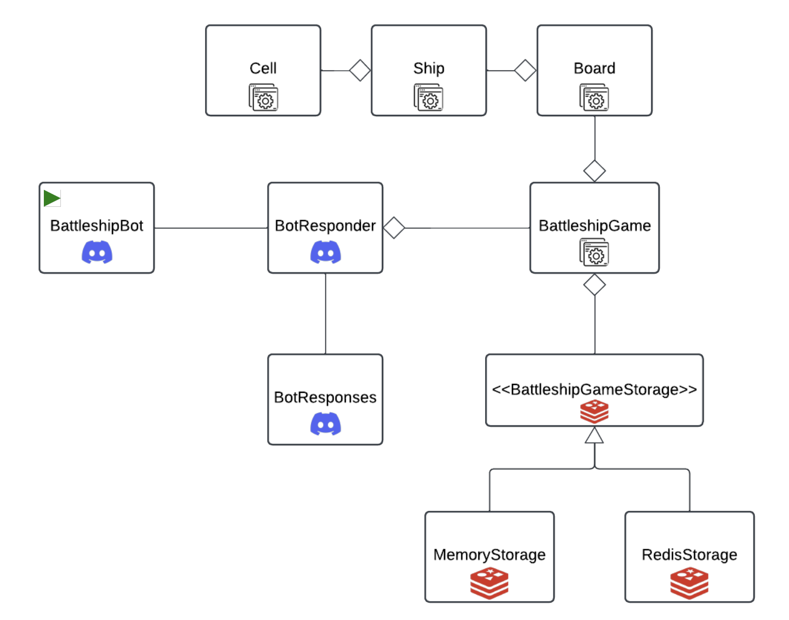

## Project Description

`This project is a Discord bot that is modeled after the popular board game Battleship. The bot will allow a single
 user to play against it in a game of Battleship. The bot is responsible for placing three ships varying in length
 on a 7x7 grid and allowing the user to guess the location of the ships using a coordinate on the grid. The bot will
 respond with a hit or miss message and will keep track of the user's past moves and ships sunk.`

## System Diagram

`This project was created with the intended purpose of keeping the application side seperate from the Discord and game 
 storage side. The Discord side is responsible for handling the user's input and output, while the application side is 
 implementing the actual game logic associated with a game of battleship. The Discord side will send the user's input to
 the application side, which will process the input and send the output back to the Discord side to be displayed to the 
 user. The application side will also be responsible for implementing game logic such as placing ships on the gameboard,
 checking if a move is a hit or miss, and checking if a ship has been sunk. The storage implements Redis to store the  
 user's remaining moves, past moves, and ships they've sunk.`

## Usage

The user can interact with the bot by sending messages in the Discord chat that are directed at the Discord bot.
The following commands are viable for the bot to respond to: 
`!playbattleship` - Starts the game of battleship 
`!endgame` - Ends a current game of battleship  
`!status` -  displays the current status of the game (Moves remaining and ships left to sink) 
`!help`  -  displays a list of commands that the bot will respond to` 

If the player begins a game they are greeted with a "Welcome to Battleship!" message that explains the rules of the 
game. If the player wishes to end the game early, they can use the !endgame command to end the game. In order to make a 
move, the player must type a point on the gameboard grid (ex. A1, B2, C3) to attempt to hit a ship. The bot will respond
with a hit or miss, or a message indicting that a ship has sunk. Players cannot reuse a past move, or make a move that
has an invalid input. The game will end when the player has sunk all three ships, or when the player has used all of 
possible moves. The player can check the status of the game at any time by using the !status command to see their
moves remaining and how many ships they have left to sink.`

